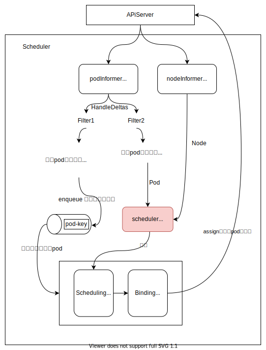
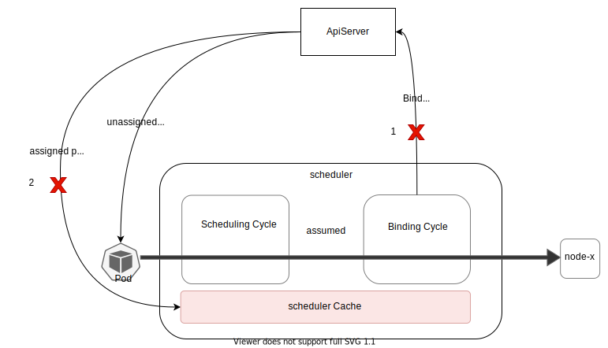
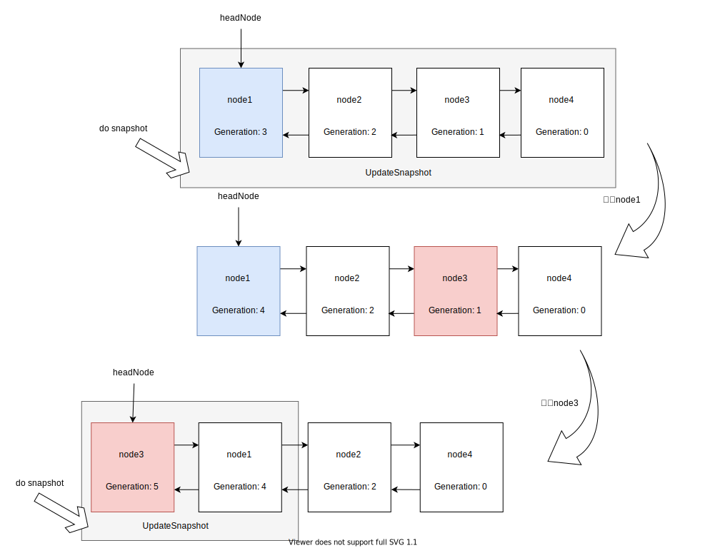

本文基于 kubernetes v1.27.1，写于: 成都，气温：忽冷忽热～

# K8s scheduler framework cache 介绍

在 k8s scheduler framework 中，内部的缓存 cache 是一块非常重要的内容，但是这部分被完全封装在 scheduler framework 内部，包括缓存内对象的新增、更新、删除。用户在使用 framework 中是无感知这个 cache 的，简单来说在各 extension point 中接触不到。下面让我们带着问题来一起学习下 scheduler cache 的设计和内容。

下述是本文思考的一些问题：


 1. [为什么需要设计一个调度器使用的 cache？](#q1)
 2. [调度器的具体内容是些什么？或者说维护了什么信息和能力？](#q2)
 3. [调度器缓存的数据是从何而来？如何维护？](#q3)
 4. [assumed pod 过期会不会存在什么隐患？](#q4)
 5. [什么时候去更新 assumed 的 pod 为 assigned？](#q5)
 6. [nodes 为什么是list？还需要将最新操作的 nodeInfo移到队列头部？](#q6)
 7. [cache 的 updatePod 为什么一定会有add事件？](#q7)
 8. [对于直接写 spec.NodeName 的 pod 还需要经过一轮调度吗？](#q8)
 9. [已经被删除的 pod （deletionTimeStamp）还会被加入到调度队列里面吗？](#q9)
 10. [已经 assumed 的 pod 还会被加入到调度队列里面吗？](#q10)
 11. [调度队列会去重吗？会不会有重复的 pod 在调度队列中等待？](#q11)
 12. [为什么会有 nodeInfo 为 nil 的情况产生？](#q12)
 13. [如果 nodeInfo 中的 node 已经为 nil 了，那么这个 nodeInfo 还会参与新一轮的调度吗？](#q13)
 14. [为什么要做 snapshot？不能在调度过程中直接使用 cache 吗？](#q14)
 15. [kubectl describe node 得到的 requested 和 cache 中的 requested 是同样的值吗？](#q15)
 16. [当前的 scheduler cache 的不足点？](#q16)

##  1. <a name='q1'></a>为什么需要设计一个调度器使用的 cache？
这个一个最基础，也是一个最直击灵魂的问题。我们知道在 k8s informer 机制中，为了减少对 ApiServer 的访问压力，我们将 ApiServer 侧的数据通过 list&watch 缓存到本地的 Indexer 中，从而避免直接访问ApiServer，而是访问 Indexer。那么为什么在调度器中不直接使用 Indexer，而是又单独搞一套 cache？能直接使用 Indexer 吗？

答案显然的：不行。下面我们从几个方面来回答，读者也可以提 MR 来一起学习啊

###  1.1. pod 的调度状态

首先让我们看一下调度状态。如下图所示，在调度的场景下，pod 与 node 的关系，除了 pending（未调度），assigned（已经调度，并 bind 完成）这两种状态能够在 Indexer 中反应之外，还有一种状态 assumed（已经调度，未 bind 完成），这种状态其实就在内存中维护了 pod 与 node 之间的对应关系。如果此时 scheduler 重启了，pod 的状态会从 assumed 退到 pending。


###  1.2. 缓存一些公共信息 (计算不出)
调度器需要一个地方能够存储一些在各轮调度之间共享的信息，比如：
- `assumedPods`：所有 assumed pods 集合
- `podStates`: podState集合，podState 包含
  - pod 信息
  - assumed pod 的过期 deadline （已去除[#110925](https://github.com/kubernetes/kubernetes/pull/110925)）

###  1.3. 缓存一些聚合信息 （能够计算得到）
需要一个地方缓存能够在调度插件中方便使用的一些聚合信息，从而提升 scheduling cycle 的计算速度，比如：
- `nodes`: nodeInfo集合，nodeInfo：每一个 node 上的聚合信息
  - pod 集合
  - 亲（反）和性信息
  - 端口分配信息
  - 资源使用现状（Requested，NonZeroRequested，Allocatable）
  - 镜像信息
  - 计数 pvc 使用的 pod 个数
- `nodeTree`：可用区 与 nodeName 的关系
- `imageStates`：image 与 node 的关系

>Tip: NonZeroRequested 统计信息：
> 1. 计算方式：统计一个节点上的所有 pod 使用的`非空`资源大小，这里`非空`是指如果 pod 内 container 的 request CPU 为空，则默认 CPU：0.1c，若 request Memory 为空，则默认内存：200M，如果不为空，就使用对应的 request
> 2. 意义：避免过多 non-request 的 pod 调度到同一个 node 之上
   

##  2. <a name='q2'></a>调度器的具体内容是些什么？或者说维护了什么信息和能力？
如下所示，是实现 cache 定义的数据结构，其主要维护了：
1. `assumedPods` sets.String: 正在 assumed 的 pod 集合
2. `podStates` map[string]*podState:  从 podKey (ns/name) 到 podState 的映射，其中 podState 的定义如下：
```go
type podState struct {
	// 此处 pod 是 assumed/assigned 的 pod
	pod *v1.Pod
	// Used by assumedPod to determinate expiration.
	// If deadline is nil, assumedPod will never expire.
	deadline *time.Time
	// Used to block cache from expiring assumedPod if binding still runs
	bindingFinished bool
}
```
3. `nodes` map[string]*nodeInfoListItem: 包含 nodeInfo 的一个双向链表
4. `headNode` *nodeInfoListItem： nodeInfo 的链表头
5. `nodeTree` *nodeTree: node 集合，内部包含了可用区列表，与对应可用区内的 nodeName 集合
6. `imageStates` map[string]*imageState: 镜像信息，从镜像名字映射到镜像信息

```go
type cacheImpl struct {
	stop   <-chan struct{}
	ttl    time.Duration
	period time.Duration

	// This mutex guards all fields within this cache struct.
	mu sync.RWMutex
	// a set of assumed pod keys.
	// The key could further be used to get an entry in podStates.
	assumedPods sets.String
	// a map from pod key to podState.
	podStates map[string]*podState
	nodes     map[string]*nodeInfoListItem
	// headNode points to the most recently updated NodeInfo in "nodes". It is the
	// head of the linked list.
	headNode *nodeInfoListItem
	nodeTree *nodeTree
	// A map from image name to its imageState.
	imageStates map[string]*imageState
}
```

具体来说可以分为三方向的能力：

1. 每一轮调度循环中需要使用的能力

`AssumePod`,` FinishBinding`, `ForgetPod`, `UpdateSnapshot` 四个方法会在 framework 的每一轮调度中被调用，具体的调用的位置见下图：


这里简述下这四个方法的内容：
- `AssumePod`：当一个 pod 完成 Scheduling Cycle，也就是找到了对应合适的 node 之后，就会通过该方法在 scheduler cache 内完成内存级别的绑定，成为 assumed pod
- ` FinishBinding`：当一个 pod 完成 Bind 阶段之后，就会调用该方法，主要是为了避免在成功 Bind 之前，assumed 的 pod 信息就在 scheduler cache 内过期。因此通过该方法显示的设置 `podState.bindingFinished` 为 true，在能开始过期 deadline 计时
- `ForgetPod`：在 pod 成为 assumed pod 之后，若在后续的插件执行过程中出错了，则会通过该方法，将 assumed 的信息从 scheduler cache 内移除
- `UpdateSnapshot`：在每一轮新的调度过程中，需要通过该方法将 scheduler cache 内最新的改变更新至调度周期内使用的 snapshot 中

2. 更新 pod 信息

`AddPod`, `UpdatePod`,`RemovePod` 三个方法来响应已经 assigned pod 的信息更新

3. 更新 node 信息

`AddNode`, `UpdateNode`, `RemoveNode` 三个方法来响应 node 的信息更新

具体接口定义如下：
```go
type Cache interface {
	...

	// AssumePod assumes a pod scheduled and aggregates the pod's information into its node.
	AssumePod(pod *v1.Pod) error

	// FinishBinding signals that cache for assumed pod can be expired
	FinishBinding(pod *v1.Pod) error

	// ForgetPod removes an assumed pod from cache.
	ForgetPod(pod *v1.Pod) error

	// AddPod either confirms a pod if it's assumed, or adds it back if it's expired.
	// If added back, the pod's information would be added again.
	AddPod(pod *v1.Pod) error

	// UpdatePod removes oldPod's information and adds newPod's information.
	UpdatePod(oldPod, newPod *v1.Pod) error

	// RemovePod removes a pod. The pod's information would be subtracted from assigned node.
	RemovePod(pod *v1.Pod) error

	// IsAssumedPod returns true if the pod is assumed and not expired.
	IsAssumedPod(pod *v1.Pod) (bool, error)

	// AddNode adds overall information about node.
	// It returns a clone of added NodeInfo object.
	AddNode(node *v1.Node) *framework.NodeInfo

	// UpdateNode updates overall information about node.
	// It returns a clone of updated NodeInfo object.
	UpdateNode(oldNode, newNode *v1.Node) *framework.NodeInfo

	// RemoveNode removes overall information about node.
	RemoveNode(node *v1.Node) error

	// UpdateSnapshot updates the passed infoSnapshot to the current contents of Cache.
	// The node info contains aggregated information of pods scheduled (including assumed to be)
	// on this node.
	// The snapshot only includes Nodes that are not deleted at the time this function is called.
	// nodeinfo.Node() is guaranteed to be not nil for all the nodes in the snapshot.
	UpdateSnapshot(nodeSnapshot *Snapshot) error

	// Dump produces a dump of the current cache.
	Dump() *Dump
}
```

##  3. <a name='q3'></a>调度器缓存的数据是从何而来？如何维护？


如上图所示，调度器缓存的初始数据源还是通过 informer 来的，其主要关心 pod 和 node 两类资源。但是对于 pod 而言，缓存只关心已经 assigned 的 pod。

对于未 assigned，并且当前调度器支持该 pod 的 schedulerName，那么就会加入到调度队列中，开始排队等待调度。

具体代码如下：
```go
	// scheduled pod cache
	informerFactory.Core().V1().Pods().Informer().AddEventHandler(
		cache.FilteringResourceEventHandler{
			FilterFunc: func(obj interface{}) bool {
				switch t := obj.(type) {
				case *v1.Pod:
					return assignedPod(t)
				case cache.DeletedFinalStateUnknown:
					if _, ok := t.Obj.(*v1.Pod); ok {
						// The carried object may be stale, so we don't use it to check if
						// it's assigned or not. Attempting to cleanup anyways.
						return true
					}
					utilruntime.HandleError(fmt.Errorf("unable to convert object %T to *v1.Pod in %T", obj, sched))
					return false
				default:
					utilruntime.HandleError(fmt.Errorf("unable to handle object in %T: %T", sched, obj))
					return false
				}
			},
			Handler: cache.ResourceEventHandlerFuncs{
				AddFunc:    sched.addPodToCache,
				UpdateFunc: sched.updatePodInCache,
				DeleteFunc: sched.deletePodFromCache,
			},
		},
	)
	// unscheduled pod queue
	informerFactory.Core().V1().Pods().Informer().AddEventHandler(
		cache.FilteringResourceEventHandler{
			FilterFunc: func(obj interface{}) bool {
				switch t := obj.(type) {
				case *v1.Pod:
					return !assignedPod(t) && responsibleForPod(t, sched.Profiles)
				case cache.DeletedFinalStateUnknown:
					if pod, ok := t.Obj.(*v1.Pod); ok {
						// The carried object may be stale, so we don't use it to check if
						// it's assigned or not.
						return responsibleForPod(pod, sched.Profiles)
					}
					utilruntime.HandleError(fmt.Errorf("unable to convert object %T to *v1.Pod in %T", obj, sched))
					return false
				default:
					utilruntime.HandleError(fmt.Errorf("unable to handle object in %T: %T", sched, obj))
					return false
				}
			},
			Handler: cache.ResourceEventHandlerFuncs{
				AddFunc:    sched.addPodToSchedulingQueue,
				UpdateFunc: sched.updatePodInSchedulingQueue,
				DeleteFunc: sched.deletePodFromSchedulingQueue,
			},
		},
	)

	informerFactory.Core().V1().Nodes().Informer().AddEventHandler(
		cache.ResourceEventHandlerFuncs{
			AddFunc:    sched.addNodeToCache,
			UpdateFunc: sched.updateNodeInCache,
			DeleteFunc: sched.deleteNodeFromCache,
		},
	)
```

##  4. <a name='q4'></a>assumed pod 过期会不会存在什么隐患？
pod 有了 assumed 状态，并且设计了 assumed 状态的超时过期逻辑，会存在什么隐患吗？

如上图所示，存在两种场景会有隐患：
1. 在 pod 还正在 binding 的过程中，cache 内 assumed 的 pod 过期了，那么在过期之后，到该 pod binding 完成，再从 apiServer 返回到 cache 中的这段时间之内，会出现该 pod 已经占用了 node 上的资源，但是并没有在调度 cache 中统计上的情况，从而导致出现过多的 pod 被调度到 node 上的情况 \
至于 pod binding 的过程为什么会比较慢，一个可能的原因：
- 用户自定义的插件（在 Assumed pod 之后）执行的特别缓慢，尤其是有 extender，发起外部 http 请求的场景下

2. 在 pod binding 完成之后，由于 APiServer 压力山大，通过 watch 至 schduler cache 的 pod 信息迟迟不到，但是 cache 内该 pod assumed 的信息已经过期，同样会出现该 pod 已经占用了 node 上的资源，但是并没有在调度 cache 中统计上的情况，从而导致出现过多的 pod 被调度到 node 上的情况

###  4.1. 上述的隐患解决了吗？如何解决的？
结论：解决了，但还有待完善（need cleanup）
下面我们分别来说：
1. 对于在 pod 完成 bind 之前过期的场景，解决如下：

```go
// 新建 cache 时，会调用 cache.run
func New(ttl time.Duration, stop <-chan struct{}) Cache {
	cache := newCache(ttl, cleanAssumedPeriod, stop)
	cache.run()
	return cache
}

// 在 cache.run 内部派发协程来清理 assumed pod
func (cache *cacheImpl) run() {
	go wait.Until(cache.cleanupExpiredAssumedPods, cache.period, cache.stop)
}

func (cache *cacheImpl) cleanupAssumedPods(now time.Time) {
	cache.mu.Lock()
	defer cache.mu.Unlock()
	defer cache.updateMetrics()

	for key := range cache.assumedPods {
		ps, ok := cache.podStates[key]
		if !ok {
			klog.ErrorS(nil, "Key found in assumed set but not in podStates, potentially a logical error")
			klog.FlushAndExit(klog.ExitFlushTimeout, 1)
		}
		// 只有 podState 内的 bindingFinished 字段为 true，才会去查看过期的 deadline。
		// 同时这个字段是在本轮的 FinishBinding() 方法中写入为 true。这个 FinishBinding
		// 方法只有在 bind 阶段结束才会被调用，因此能够保证在 bind 完成之前 assumed 的 pod
		// 信息一定不会过期
		if !ps.bindingFinished {
			klog.V(5).InfoS("Could not expire cache for pod as binding is still in progress", "podKey", key, "pod", klog.KObj(ps.pod))
			continue
		}
		if cache.ttl != 0 && now.After(*ps.deadline) {
			klog.InfoS("Pod expired", "podKey", key, "pod", klog.KObj(ps.pod))
			if err := cache.removePod(ps.pod); err != nil {
				klog.ErrorS(err, "ExpirePod failed", "podKey", key, "pod", klog.KObj(ps.pod))
			}
		}
	}
}
```

2. 对于从 Apiserer 返回至 cache 的时间过长的场景：

最终的解决办法就是：去除过期逻辑，永不过期。

```go

// 在新建 scheduler cache 的时候需要传递 assumed pod 的过期时间
schedulerCache := internalcache.New(durationToExpireAssumedPod, stopEverything)

// 当前的版本是为0，表示永不过期
const (
	// Duration the scheduler will wait before expiring an assumed pod.
	// See issue #106361 for more details about this parameter and its value.
	durationToExpireAssumedPod time.Duration = 0
)
```

最初的超时时间是 30s， 但是发现在大规模的集群（node 个数比较多）时，会出现资源竞争的情况，因此不停的调大该值，一直到了 15min，但是始终不是一个好的解决办法，因此在
[MR](https://github.com/kubernetes/kubernetes/pull/110925) 中将超时时间设置为了 0，
同时其中讨论说，在经过两个稳定的版本迭代之后，需要将 assumed pod 过期的逻辑完全去除（有兴趣的小伙伴可以一试）。

##  5. <a name='q5'></a>什么时候去更新 assumed 的 pod 为 assigned？

在 framework 内部有一个叫 `DefaultBinder` 的 intree 插件，其来负责将在 scheduler 内部 assumed 的 pod 真正 bind 到 apiServer。 如下代码所示：

```go
// Bind binds pods to nodes using the k8s client.
func (b DefaultBinder) Bind(ctx context.Context, state *framework.CycleState, p *v1.Pod, nodeName string) *framework.Status {
	klog.V(3).InfoS("Attempting to bind pod to node", "pod", klog.KObj(p), "node", klog.KRef("", nodeName))
	binding := &v1.Binding{
		ObjectMeta: metav1.ObjectMeta{Namespace: p.Namespace, Name: p.Name, UID: p.UID},
		Target:     v1.ObjectReference{Kind: "Node", Name: nodeName},
	}
	err := b.handle.ClientSet().CoreV1().Pods(binding.Namespace).Bind(ctx, binding, metav1.CreateOptions{})
	if err != nil {
		return framework.AsStatus(err)
	}
	return nil
}
```

值得注意的是：bind 阶段的插件可以配置多个，但是只要在顺序执行过程中，其中的任何一个插件返回 success，后续的插件就不会继续执行。如果期望除了自身之外的其他插件也能够运行，返回 skip 状态即可。

Tips: 多个插件的执行顺序：首先执行 customer 定义的插件（顺序和 profile 内定义的一致），之后执行 default 定义的插件。trick：可以在 customer 内部调整 default 的顺序。

##  6. <a name='q6'></a>nodes 为什么是list？还需要将最新操作的 nodeInfo移到队列头部？
我们查看 cache 的数据结构内的 node，发现其是一个链表的设计，并且在涉及到 nodeInfo 的变更（比如有新的 pod 调度到该 node，或者有该 node 上的 pod 被删除等），都需要将该 nodeInfo 移动到队列头部。为什么要这么设计呢？

答案是为了做 snapshot 更快，更方便，不用遍历所有的 node，而是只需要遍历从上次更新 snapshot 到当前存在变更的 node 集合。

并且，`UpdateSnapshot` 是一个非常频繁的操作，每调度一个新的 pod，就需要调用该方法来刷新 snapshot，因此提高该方法的执行效率是非常有必要的。


```go
// schedulePod tries to schedule the given pod to one of the nodes in the node list.
// If it succeeds, it will return the name of the node.
// If it fails, it will return a FitError with reasons.
func (sched *Scheduler) schedulePod(ctx context.Context, fwk framework.Framework, state *framework.CycleState, pod *v1.Pod) (result ScheduleResult, err error) {
	...
	if err := sched.Cache.UpdateSnapshot(sched.nodeInfoSnapshot); err != nil {
		return result, err
	}
	trace.Step("Snapshotting scheduler cache and node infos done")
    ...
```

如下图所示，我们说明 NodeInfo 链表的设计，以及处处维护链表头的过程：


1）起初集群中存在四个 node，同时 generation 到 3，此时做了一次 snapshot，将所有的 node 都打到了快照中，此时 snapshot 的 snapshotGeneration 为 3。

2）node1 发生了更新，更新 node1 的 generation 为 4，此时 node1 已经在头部就不需要移动了。

3）node3 发生了更新，更新 node3 的generation 为 5，并将 node3 移动到链表头部。此时做 snapshot，我们从 headNode 开始遍历，只需要遍历 node3，node1 即可。因为 node2 的 generation 为 2，小于此时的 snapshotGeneration（值为 3）。之后将 snapshotGeneration 更新为 5。

因此，从这个例子中，在第 3）步骤更新 snapshot 时，只需要遍历从上次更新 snapshot 到当前存在变更的 node 集合（node3， node1），而不需要遍历所有的 node。这在大规模的集群中是非常有必要的。
##  7. <a name='q7'></a>cache 的 updatePod 为什么一定会有add事件？
因为，我们通常理解，在有新的 pod 被创建之后，通过 informer 机制就会有 Add 事件响应到客户端。但是对于响应到 cache 的 assigned pod 而言，其一定是早就被创建了，也就是说在这个 pod 还没有被调度，处于 unassigned 的时候就会有 Add 事件产生，但是此时 cache 的 informer filter 了此类 unassigned 的 pod 的事件。所以当 pod 被调度完成之后，从 unassigned 状态到了 assigned 状态之后，应该是一个 Update 事件，而不是一个 Add 事件。

那么，事实是什么样的呢？

对于已经调度完成（assigned）的 pod，使用`cache.FilteringResourceEventHandler`来处理 list&watch 的事件时，在 pod Update 的场景下，基于不同的 Filter 结果，响应为不同的状态。因此当 pod 首次被调度完成之时，其 Update 事件会被更新为 Add 事件。因为对于这个 eventHandler 内的 listener 而言，它们是首次 watch 到这个事件。
```go
// OnUpdate ensures the proper handler is called depending on whether the filter matches
func (r FilteringResourceEventHandler) OnUpdate(oldObj, newObj interface{}) {
	newer := r.FilterFunc(newObj)
	older := r.FilterFunc(oldObj)
	switch {
	case newer && older:
		r.Handler.OnUpdate(oldObj, newObj)
	case newer && !older:
		r.Handler.OnAdd(newObj, false)
	case !newer && older:
		r.Handler.OnDelete(oldObj)
	default:
		// do nothing
	}
}
```

##  8. <a name='q8'></a>对于直接写 spec.NodeName 的 pod 还需要经过一轮调度吗？

答案是显然的，不需要。

1）从设计考虑，调度器的任务本质就是将 pod 与 node 之间建立绑定关系，如果这个关系已经存在了，那么就不需要调度器做什么事情了。

2）从实现出发，只有 unassigned（未调度的）pod 才会被放入到待调度队列中，已经调度完成的 pod 会直接进入调度 cache。

##  9. <a name='q9'></a>已经被删除的 pod （deletionTimeStamp）还会被加入到调度队列里面吗？

是会的，但是会在一个调度周期的初始阶段就过滤掉
```go
func (sched *Scheduler) scheduleOne(ctx context.Context) {
	podInfo := sched.NextPod()
	...
	if sched.skipPodSchedule(fwk, pod) {
		return
	}
}
```

```go
func (sched *Scheduler) skipPodSchedule(fwk framework.Framework, pod *v1.Pod) bool {
	// Case 1: pod is being deleted.
	if pod.DeletionTimestamp != nil {
		fwk.EventRecorder().Eventf(pod, nil, v1.EventTypeWarning, "FailedScheduling", "Scheduling", "skip schedule deleting pod: %v/%v", pod.Namespace, pod.Name)
		klog.V(3).InfoS("Skip schedule deleting pod", "pod", klog.KObj(pod))
		return true
	}

	// Case 2: pod that has been assumed could be skipped.
	// An assumed pod can be added again to the scheduling queue if it got an update event
	// during its previous scheduling cycle but before getting assumed.
	isAssumed, err := sched.Cache.IsAssumedPod(pod)
	if err != nil {
		utilruntime.HandleError(fmt.Errorf("failed to check whether pod %s/%s is assumed: %v", pod.Namespace, pod.Name, err))
		return false
	}
	return isAssumed
}
```
##  10. <a name='q10'></a>已经 assumed 的 pod 还会被加入到调度队列里面吗？

是会的。但是如上所述，会在一个调度周期的初始阶段就过滤掉。

##  11. <a name='q11'></a>调度队列会去重吗？会不会有重复的 pod 在调度队列中等待？

会去去重的，其内部的 activeQ 是一个堆的结构，其支持的 Add 方法在已经存在元素时只会更新，不会再新增。
```
// Add inserts an item, and puts it in the queue. The item is updated if it
// already exists.
func (h *Heap) Add(obj interface{}) error {
	key, err := h.data.keyFunc(obj)
	if err != nil {
		return cache.KeyError{Obj: obj, Err: err}
	}
	if _, exists := h.data.items[key]; exists {
		h.data.items[key].obj = obj
		heap.Fix(h.data, h.data.items[key].index)
	} else {
		heap.Push(h.data, &itemKeyValue{key, obj})
		if h.metricRecorder != nil {
			h.metricRecorder.Inc()
		}
	}
	return nil
}
```

##  12. <a name='q12'></a>为什么会有 nodeInfo 中的 node 为 nil 的情况产生？
会有两种情况：

1. 直接指定 pod.spec.nodeName 但是对应的 node 不在 cache 中存在
2. 因为我们在 watch 到 node 的删除事件，开始执行 `RemoveNode` 来删除 node时，如果此时 node 上还有 pod，会保留对应的 nodeInfo，但是其中的 node 会被置为 nil。具体的代码如下所示：

```go
func (cache *cacheImpl) RemoveNode(node *v1.Node) error {
	cache.mu.Lock()
	defer cache.mu.Unlock()

	n, ok := cache.nodes[node.Name]
	if !ok {
		return fmt.Errorf("node %v is not found", node.Name)
	}
	// 在这里内部会将 node 置为 nil
	n.info.RemoveNode()
	// We remove NodeInfo for this node only if there aren't any pods on this node.
	// We can't do it unconditionally, because notifications about pods are delivered
	// in a different watch, and thus can potentially be observed later, even though
	// they happened before node removal.
	if len(n.info.Pods) == 0 {
		cache.removeNodeInfoFromList(node.Name)
	} else {
		cache.moveNodeInfoToHead(node.Name)
	}
	if err := cache.nodeTree.removeNode(node); err != nil {
		return err
	}
	cache.removeNodeImageStates(node)
	return nil
}
```
此种情况下，最终这个 nodeInfo 的删除，会放在 `RemovePod` 中来执行，具体如下所示：
```go
func (cache *cacheImpl) removePod(pod *v1.Pod) error {
	key, err := framework.GetPodKey(pod)
	if err != nil {
		return err
	}

	n, ok := cache.nodes[pod.Spec.NodeName]
	if !ok {
		klog.ErrorS(nil, "Node not found when trying to remove pod", "node", klog.KRef("", pod.Spec.NodeName), "podKey", key, "pod", klog.KObj(pod))

	} else {
		if err := n.info.RemovePod(pod); err != nil {
			return err
		}
		if len(n.info.Pods) == 0 && n.info.Node() == nil {
			// 在 nodeInfo 上的 node 为 nil，并且 node 上的 pod 都被删除之后
			// 就会在 cache 内删除这个 node
			cache.removeNodeInfoFromList(pod.Spec.NodeName)
		} else {
			cache.moveNodeInfoToHead(pod.Spec.NodeName)
		}
	}

	delete(cache.podStates, key)
	delete(cache.assumedPods, key)
	return nil
}
```

##  13. <a name='q13'></a>如果 nodeInfo 中的 node 已经为 nil 了，那么这个 nodeInfo 还会参与新一轮的调度吗？
先说结论：不会！

因为每一轮的调度都会调用 UpdateSnapshot 方法来更新这轮调度的信息，并且在这个方法中会将 node 为 nil 的 nodeInfo 给过滤掉。
```go
	// UpdateSnapshot updates the passed infoSnapshot to the current contents of Cache.
	// The node info contains aggregated information of pods scheduled (including assumed to be)
	// on this node.
	// The snapshot only includes Nodes that are not deleted at the time this function is called.
	// nodeinfo.Node() is guaranteed to be not nil for all the nodes in the snapshot.
	UpdateSnapshot(nodeSnapshot *Snapshot) error
```

##  14. <a name='q14'></a>为什么要做 snapshot？不能在调度过程中直接使用 cache 吗？
直接使用 cache 会存在一个问题：
1. 调度 scheudling cycle 过程中，可能会引起 cache 的更新（因为node，或者pod 的更新事件到达），从而导致整个调度过程中的数据不一致问题。也就是比如：nodeA 参与了 filter 阶段，但是参加 score 之前被删除了，此时是算 nodeA 还是不算呢？

对于使用 snapshot 有以下好处：
1. 同时提升 cache 和 调度 scheduling cycle 的效率，因为所有对于 cache 的操作都需要通过锁来进行保护，因此如果将写cache和读 cache 的流程分开来，能够同时保证两者的高效，一方面：通过 informer watch 最新的数据变化，之后写 cache，保证 eventHandler 内 listener 处理的时效性。另一方面：通过使用 snapshot，避免和写流程抢锁，提升 scheduling cycle 的效率。
2. snapshot 中保留的 node 都是当下未被删除的 node，因此可以在调度周期内直接使用对应的 nodeInfo

当然，我理解使用 snapshot 也会带来一些问题：
1. pod 可能会被调度到“已经”删除的 node 上。\
这里给“已经”打上了双引号，因为这个删除 node 的事件可能只是到达了 ApiServer，并没有通过 informer watch 到达 scheduler。因为 node 和 pod 的事件是通过两个 informer 来通知的，因此必不可免的出现，pod 开始调度，并且做完 snapshot(包含在 ApiServer 已经删除的 node) 之后，该 node 的删除事件才到达 cache。但是，这种情况可以比较乐观的看待，因为：
  - 触发的概率很低：因为 
    - 1）一般 informer 的 watch 时效和 scheduling cycle 的效率都比较高
    - 2）还需要保证 pod 在众多的 node 中选中该 node
  - node 的删除事件触发的频率不高，并且一般前序还伴随着 cordon
  - 场景恢复的代价很低：让 pod 重新参与调度即可
  
*Tip: cordon 节点，其实就是给 node 打了一个如下 taint*
```yaml
  - effect: NoSchedule
    key: node.kubernetes.io/unschedulable
    timeAdded: "2023-03-15T06:24:28Z"
```

##  15. <a name='q15'></a>kubectl describe node 得到的 requested 和 cache 中的 requested 是同样的值吗？
先说结论：不是

因为调用 `kubectl describe node` 时，都是基于 ApiServer 的数据（assigned pod）来进行计算的，但是 cache 内的数据除了 assigned pod 之外，还有在调度内 assumed 的 pod 信息。

##  16. <a name='q16'></a>当前的 scheduler cache 的不足点？
1. 没有开放给用户一些安全的接口，导致用户没有一个全局缓存来共享各轮调度之间的聚合数据。因此在每一轮调度时，都需要基于 snapshot 来重新计算一次用户聚合数据